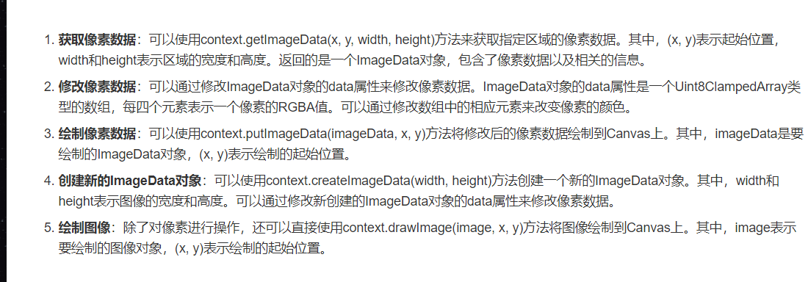
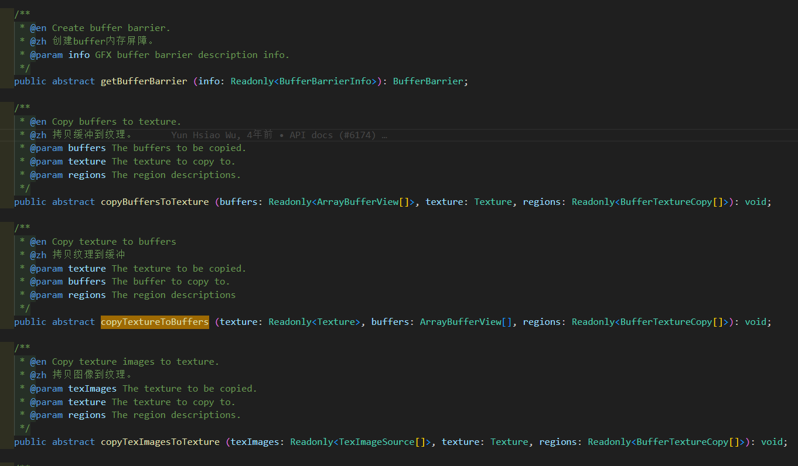

- [像素操作多种思路](#像素操作多种思路)
  - [1:  H5 canvas api](#1--h5-canvas-api)
  - [2.1:  摄像机 + renderTexture，截取整屏像素](#21--摄像机--rendertexture截取整屏像素)
  - [2.2:  摄像机 + renderTexture，直接获取指定texture的像素](#22--摄像机--rendertexture直接获取指定texture的像素)
  - [3： 加载资源文件指定为ArrayBuffer格式](#3-加载资源文件指定为arraybuffer格式)
  - [4：图形学接口，device + gfx.](#4图形学接口device--gfx)

## 像素操作多种思路
    方法使用原理各不相同，使用场景也各有不同，已知条件可能是image, texture, 资源对应的文件路径等。最终的思路都是将资源转为ArrayBuffer,然后进行像素操作，再重新生成想要的图像资源。

### 1:  H5 canvas api
    利用 canvas 操作直接获取image数据修改，可以直接在web中使用。


### 2.1:  摄像机 + renderTexture，截取整屏像素
    新建一个摄像机，通过分组设置，使摄像机只拍摄需要分析的节点， 新建renderTexture来承接摄像机的渲染数据。然后分析通过renderTexture.readPixels()读取像素数据。  
    注意：需要等待渲染完成，异步读取数据。
```  ts
    /**
     * 初始化
     * 通过设置摄像机配合分组拍摄待处理纹理，然后绑定renderTexture, 
     * 缺点是：会渲染摄像机拍到的整屏图，而且生成的纹理最终是倒置的 需要手动翻转y
     */
    private init() {
        let texture = this.source.getTexture();
        const spf = new cc.SpriteFrame();
        spf.setTexture(texture);
        this.renderCamera.getComponentInChildren(cc.Sprite).spriteFrame = spf;

        let rt = new cc.RenderTexture();
        rt.initWithSize(texture.width, texture.height);
        this.renderCamera.targetTexture = rt;
        this.renderTexture = rt;
    }

    /**读取 修改像素值 */
    private readTexture() {
        let data = this.renderTexture.readPixels();
        let w = this.renderTexture.width;
        let h = this.renderTexture.height;
        let rowBytes = w * 4;

        for (let x = 0; x < h; x++) {
            for (let y = 0; y < w; y++) {
                let p = cc.v2(y, x);
                let idx = x * rowBytes + y * 4;
                if (data[idx + 3] === 0) {
                    data[idx] = 255;
                    data[idx + 1] = 255;
                    data[idx + 2] = 255;
                    data[idx + 3] = 255;
                }
                if (this.isSelected(p)) {
                    data[idx] = 0;
                    data[idx + 1] = 255;
                    data[idx + 2] = 0;
                    data[idx + 3] = 255;
                }
            }
        }
        let texture = new cc.Texture2D();
        // texture.setFlipY(true)
        texture.initWithData(data, this.renderTexture.getPixelFormat(), this.renderTexture.width, this.renderTexture.height);
        let spf = new cc.SpriteFrame();
        spf.setTexture(texture);
        this.target1.spriteFrame = spf;
    }
```

### 2.2:  摄像机 + renderTexture，直接获取指定texture的像素
    整体思路与上面相同，区别为不用被动依靠摄像机的渲染功能，直接利用renderTexture的drawTexture(texture)方法主动写入数据。读取方法与上面相同。
    相同地，也是需要等写入完成后，异步读取数据
``` ts
    /**使用单张texture自己构造renderTexture 
     * 注意：必须要与一个相机绑定
     * 优点：只处理指定纹理的像素数据，并且纹理y方向不会倒置
    */
    private init2() {
        let texture = this.source.getTexture();
        // texture.packable = false
        let rt = new cc.RenderTexture();
        rt.initWithSize(texture.width, texture.height);
        //@ts-ignore
        rt.drawTextureAt(texture);
        this.renderTexture = rt;
        this.renderCamera.targetTexture = this.renderTexture;
    }
```

### 3： 加载资源文件指定为ArrayBuffer格式
    适用于知道图像资源路径，在加载时直接指定数据格式为ArrayBuffer,再做后续处理。

### 4：图形学接口，device + gfx.
    利用texture得到内置的GFXTexture对象。然后直接将GFXTexture转为buffer。也是renderTexture.readPixels的实现方法。
``` ts
    public readPixels (x = 0, y = 0, width?: number, height?: number, buffer?: Uint8Array) : Uint8Array | null {
        width = width || this.width;
        height = height || this.height;
        const gfxTexture = this.getGFXTexture();
        if (!gfxTexture) {
            errorID(7606);
            return null;
        }
        const needSize = 4 * width * height;
        if (buffer === undefined) {
            buffer = new Uint8Array(needSize);
        } else if (buffer.length < needSize) {
            errorID(7607, needSize);
            return null;
        }

        const gfxDevice = this._getGFXDevice();

        const bufferViews: ArrayBufferView[] = [];
        const regions: BufferTextureCopy[] = [];

        const region0 = new BufferTextureCopy();
        region0.texOffset.x = x;
        region0.texOffset.y = y;
        region0.texExtent.width = width;
        region0.texExtent.height = height;
        regions.push(region0);

        bufferViews.push(buffer);
        gfxDevice?.copyTextureToBuffers(gfxTexture, bufferViews, regions);
        return buffer;
    }
```
    扩展： gfx.device还有其他相关数据互转api，具体可在gfx源码中查看


