# 环境准备
    整体参考creator文档跨平台发布。  
    大致流程 ： 
1. 安装jdk 1.8版本。配置环境变量 JAVA_HOME : jdk目录（要配到bin目录为止），保险起见配置完重启让环境变量生效。
2. 下载 android studio 并安装。完成后新建一个test项目，打开项目。如图找到sdk manager 设置sdk  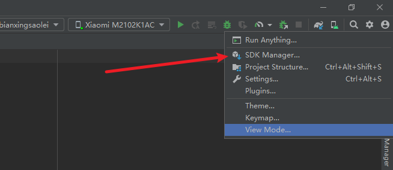,如图设置 sdk 路径，勾选需要支持的安卓版本。并在sdk tools 勾选相关工具。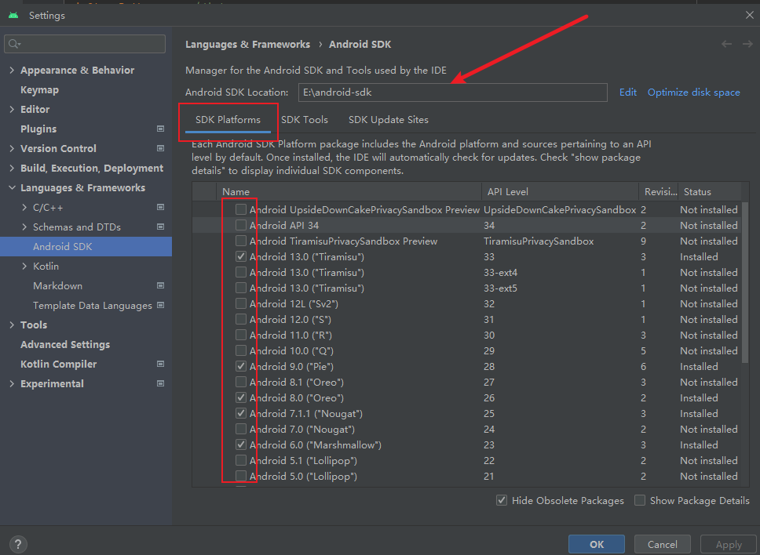  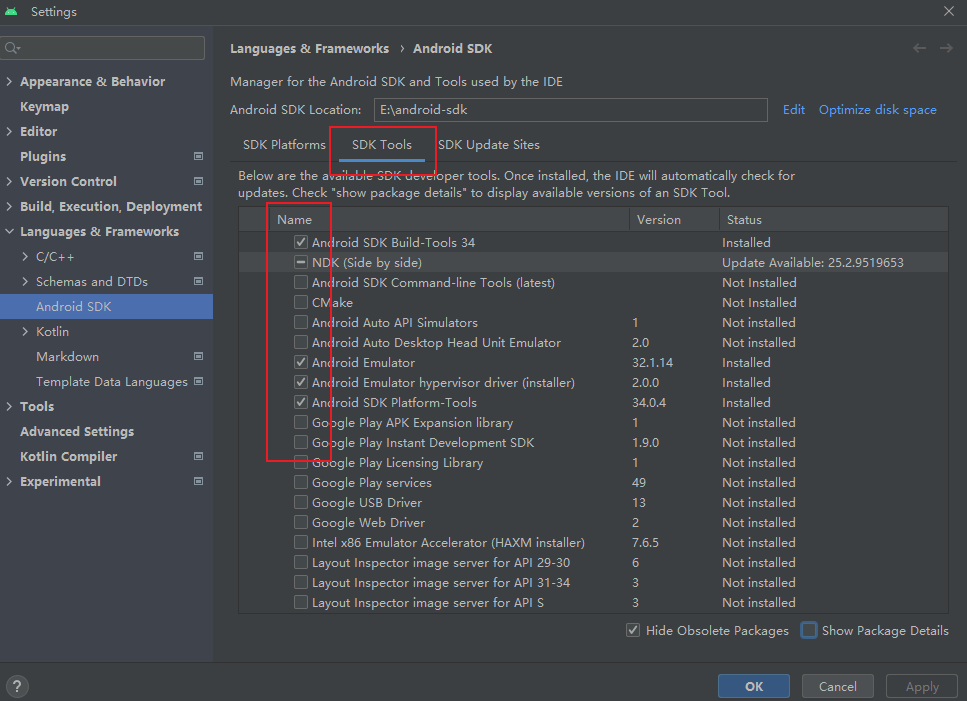 重点是ndk选择版本不要太高 可能有兼容问题。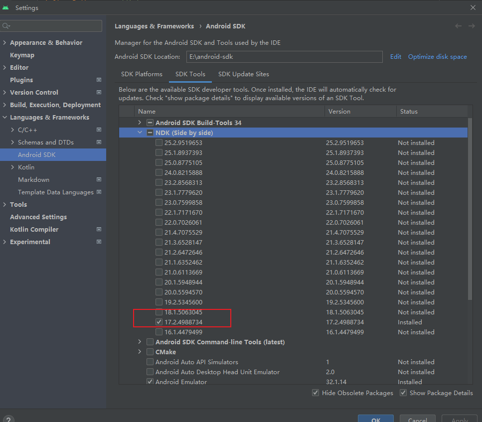 勾选完成后，点击ok开始下载安装

# 操作
1. 打开creator项目，点击 文件/设置，填写原生开发环境相关路径。设置sdk和ndk路径，注意：ndk路径要一直到ndk目录下的具体版本目录。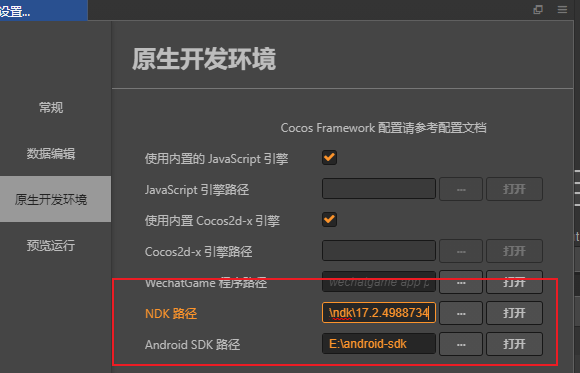
2. creator 构建安卓工程，参数可以参考下图：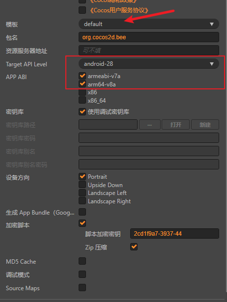, 构建成功后，转回 android studio 编译。
3. 最好将构建成功的目录转移到磁盘根目录下，有时候会有路径过长导致后续失败，原构建的目录如图，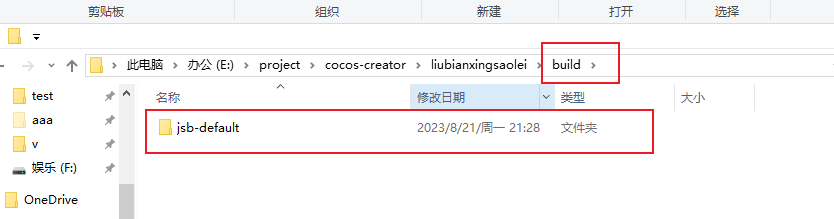
4. 回到 android studio，file/close 先关闭之前的test项目（如果没开test项目不用管），回到入口界面。打开刚刚转移过来的工程。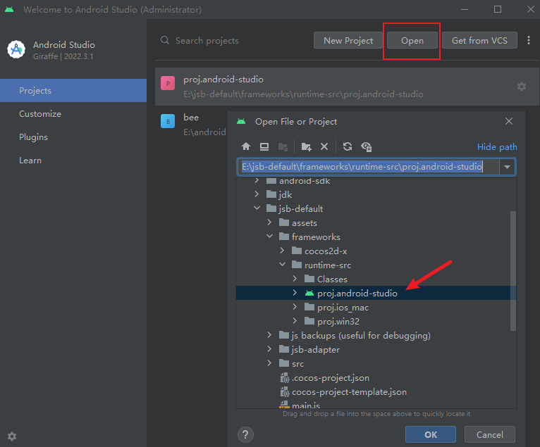， 有时候初始化时下面会报红提示 升级之类的，按操作下载升级就行。界面初始化完成后检查一些参数设置，
   - file/Project Structure: 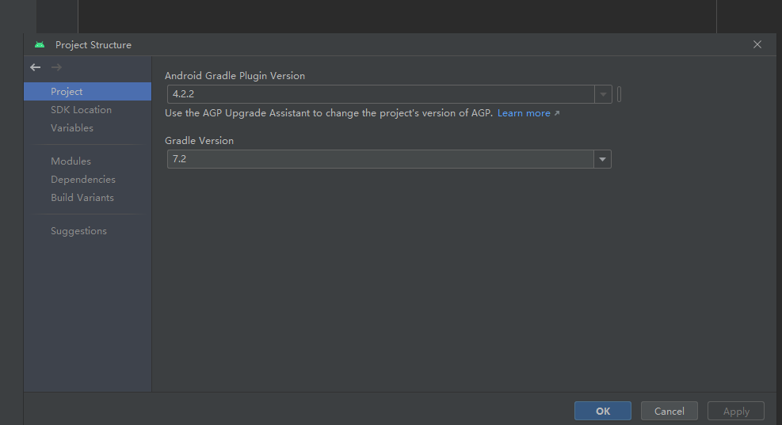 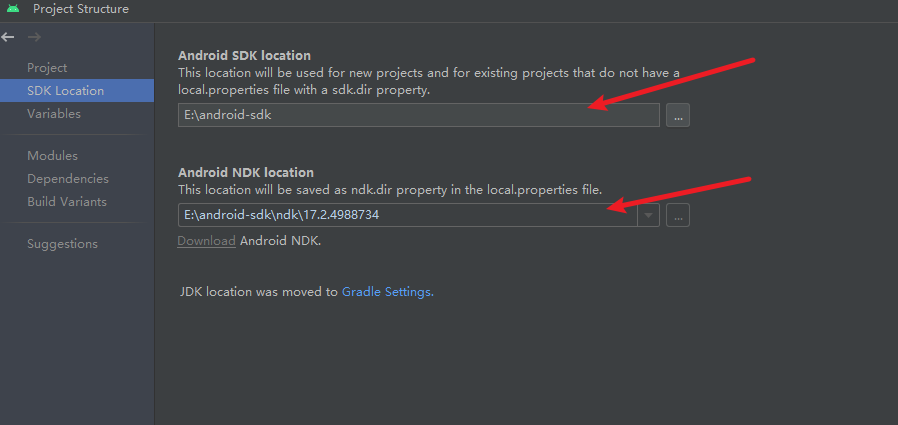
   - file/settings: 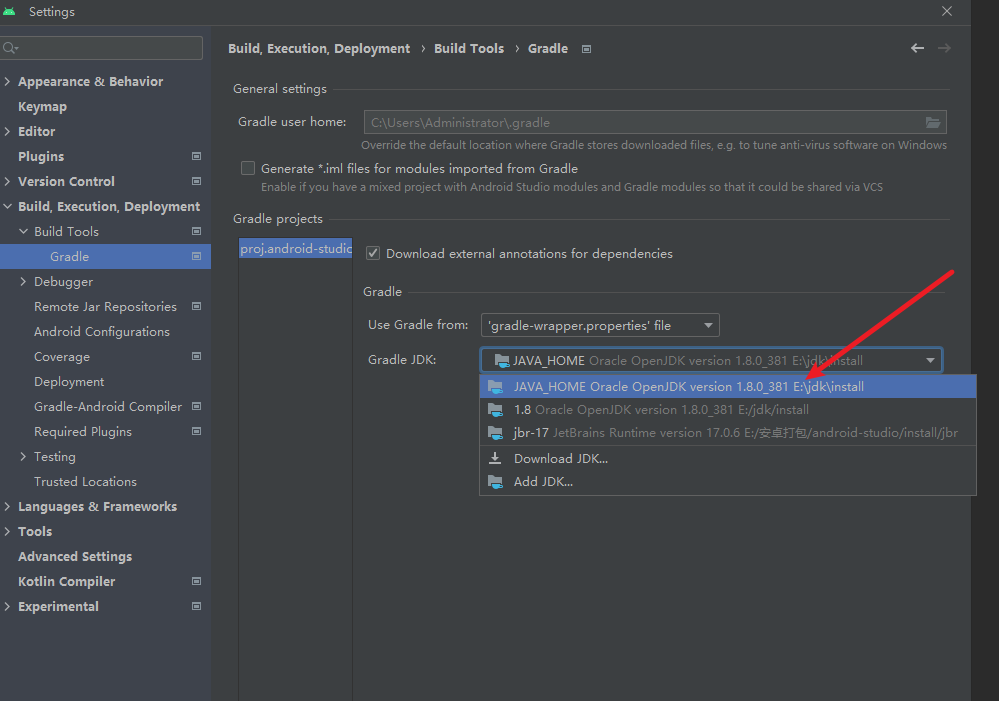 这个好像项目进以后都要重新设置 不然会有问题
5. 硬件准备，首次打开开发者模式（新机器从未打开的可以连续快速点击系统图标触发开发者模式选项），设置 允许usb安装应用。usb模式为：文件传输。连接成功后 studio 右上角会显示连接的手机 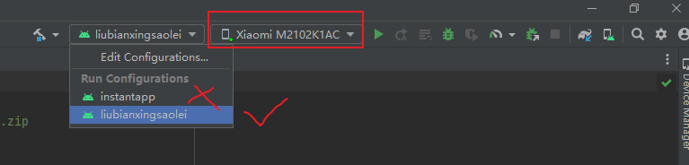
6. 准备全部完成，保持手机界面亮着，点击后面的三角形开始编译，顺利的话，等等就可以开始安装了
7. 出错调试常用操作：clean Project：清除上次编译的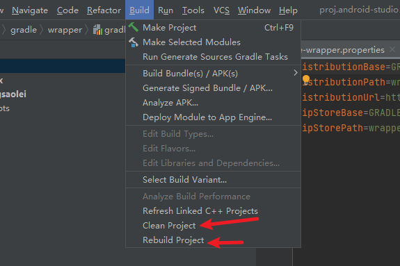
    重新编译前同步文件 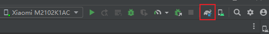