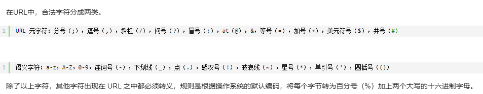
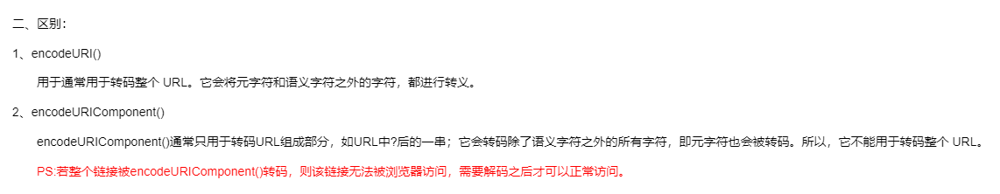

# url相关
### 编码解码
    参考地址：https://www.cnblogs.com/morango/p/17276792.html；

### 静态方法生成
    URL.createObjectURL();     
    将一个引用类型的对象在内存中生成一个地址，可以使用这个地址来只想内存中存储的对象。除非document关闭，否则不会被垃圾回收机制回收，需要在不用时手动调用 URL.revokeObjectURL() 释放；

