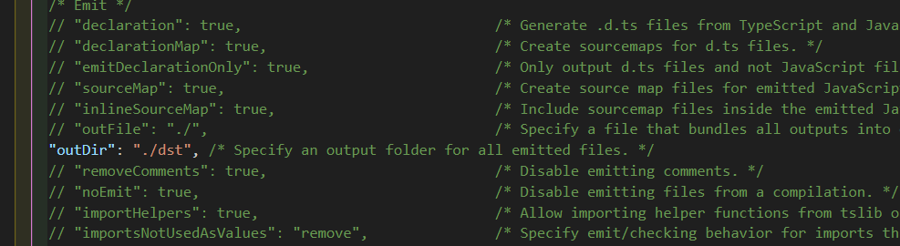
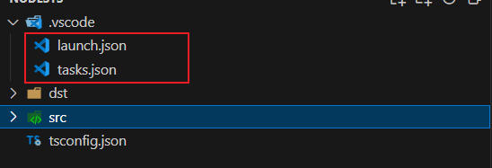

1. 准备环境，安装node js，使用npm安装typescript包用于编译ts。
2. 使用vscode打开项目，两种方式初始化ts配置文件。一是在命令行用ts init, 二是在vscode 终端-运行任务-ts构建 执行任务构建ts；
3. 修改ts相关配置，主要是输出目录。
   
4. vscode中，终端-运行任务-ts监视，检测到修改保存后自动编译。同时可以在.vscode目录下看见任务配置文件task.json，也可以在配置文件中配置多个任务，通过终端运行具体任务;
5. vscode中，运行添加配置，在.vscode下添加启动配置，配置相关参数。不然默认的运行都是运行当前文件，有了启动配置后直接运行配置的入口。
   