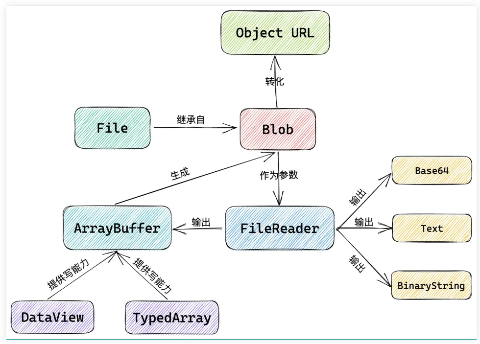
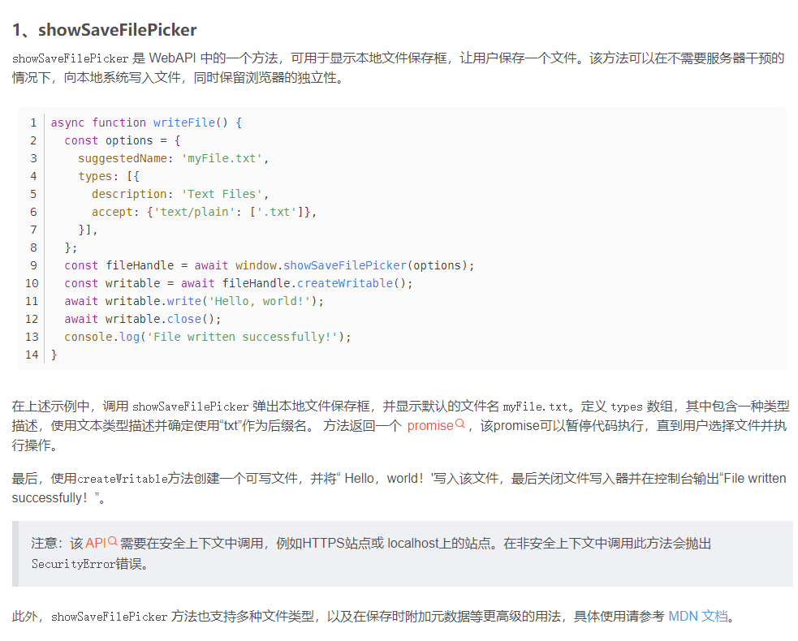

## 内存操作相关对象
### ArrayBuffer
### TypeArray
### DataView
### Blob + URL.createObjectURL()
### File + FileReader

参考说明：https://www.cnblogs.com/yinpengfei/p/17280585.html

## MIME 文件类型
    MIME 类型通常由两部分组成：主类型和子类型，用斜杠分隔。常见的主类型包括 text、image、audio、video、application 等，而子类型则是具体的文件类型，比如 plain、html、png、jpeg、json 等。

## 保存在本地
    node环境下可以使用fs等， 但在web中只有2个方法，
1. 使用a标签的download功能下载；是否弹出下载位置对话框可以通过浏览器的下载设置控制
```js
    function download(content, name, type) {
        const blob = new Blob([content], { type: type });
        const url = URL.createObjectURL(blob);
        let a = document.createElement(`a`);
        a.href = url;
        a.download = name;
        //经过测试可以不用加到dom中，下载依然生效
        // document.body.appendChild(a);
        // a.style.display = `none`;
        a.click();
        URL.revokeObjectURL(url);
        // document.body.removeChild(a);
    }
```
2. 使用新的实验性api：


## 从本地上传 
    使用 input 标签的file类型  <input type="file" id="fileInput" multiple>
