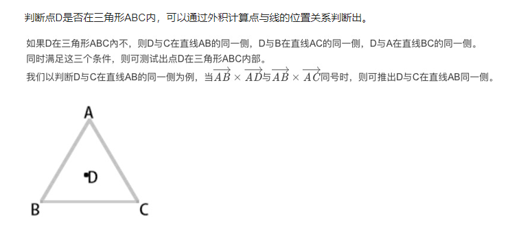

## 基础方法
1. 构造正交向量：2d中， 已知单个向量A，可以把向量看作复数，通过复乘 i，构造出与A垂直的向量B。 通过AB叉乘构造法向量C；
2. 判定平行类，趋向于判定两向量的相似性： 使用叉乘，结果为0：平行或共线；
3. 判定是否被指定线划分： 已知向量p，判定点A和点B是否在p的两边。p x A 与 p x B的结果异号，则A,B分别在p的两边。
4. 判定垂直类， 趋向于判定两向量的不相关性： 使用点乘，结果为0，判定为垂直

## 应用
1. 两线段AB, CD是否相交: 
    - 以AB为分界，用叉乘判定C,D是否再AB两边；(AB X AC) * (AB X AD) < 0
    - 以CD为分界，用叉乘判定A,B是否再CD两边；(CD X CA) * (CD X CB) < 0
2. 线段AB与射线PD(P为起点)是否相交：
   - 以射线PD为分解，用叉乘保证AB在两边；(PD X PA) * (PD X PB) < 0
   - 以PA为分界，用叉乘保证PB和PD在同一侧；(PA X PB) * (PA X PD) > 0
3. 点p是否在多边形内：与多边形的交点个数n，n为偶数，点在外部；n为奇数，点在内部；
    - 特别地，点是否在三角形内，方法二：
    
4. 判定多边形凸点，凹点：叉乘判定，如果是凸点，根据右手定则，旋转角 < 180, 正弦值为正，所以叉乘结果 > 0     
   - ABC为连续的三点，要判定B点的凹凸性，如果 BA x CB > 0 为凸点，否则为凹点。
