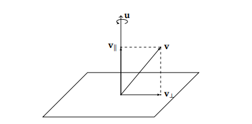
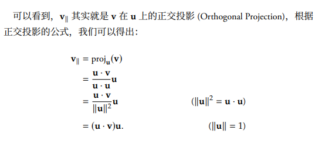
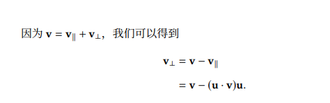
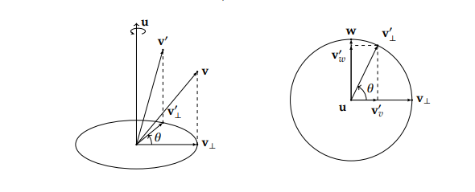
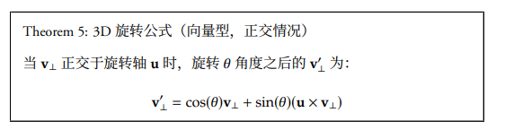
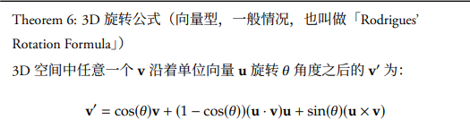
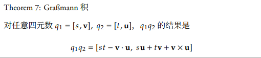
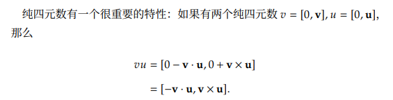
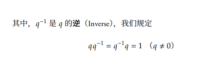
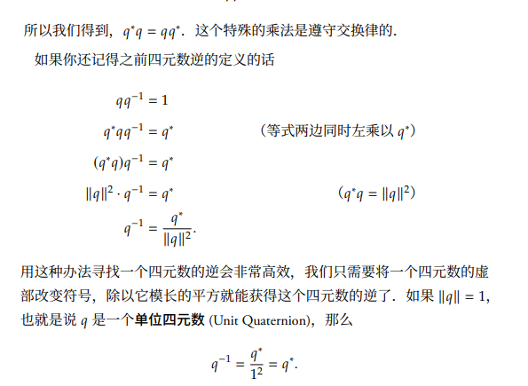

# 三维旋转
轴角旋转可以分解为平行，垂直分量旋转，平行分量对旋转没有贡献。  
问题可以简化为，已知 **u（旋转轴）** **v(待旋转向量)** **旋转角**, 求旋转后的向量 **u'**  

## 平行分量
相当于原向量与旋转轴产生联系的方式，两个向量确定了旋转前的空间系统是唯一的，即我要对这个确定的空间关系的向量旋转，根据这两个向量的输入直接输出平行分量的输出，用矢量减法输出垂直分量。  
平行分量旋转后不变  

## 垂直分量
  
垂直分量旋转后的表达式  

## 组合起来
  
相当于由旋转轴方向， 原向量，这两个叉乘的正交向量。这三个向量的叠加

# 四元数表示
1. ijk规则
2. 模长表示
3. 加减法，数乘
4. 四元数相乘， 四实数坐标形式，实数+向量形式，矩阵形式
用实数+向量表示乘法  

5. 纯四元数：实部为0  

6. 逆：除法  

7. 共轭： 可以用来求逆  
  

# 旋转与四元数的联系

