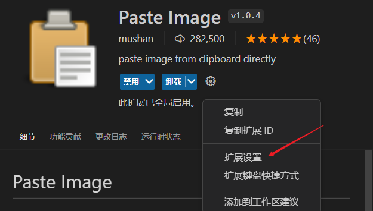
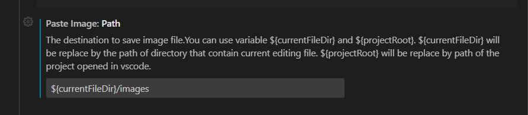
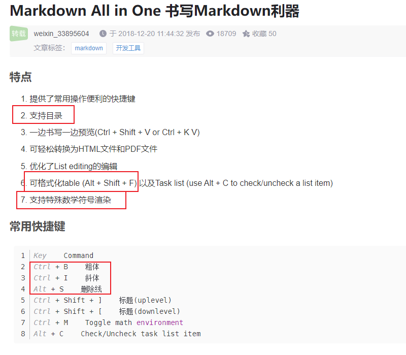
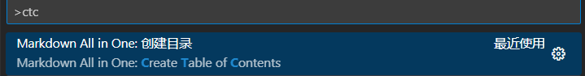

- [基础语法](#基础语法)
- [快速编辑](#快速编辑)
  - [准备](#准备)
  - [常用快捷键](#常用快捷键)
  - [自动生成目录](#自动生成目录)
  - [快速贴图](#快速贴图)

# 基础语法
参考菜鸟教程 
[https://www.runoob.com/markdown/md-tutorial.html](https://www.runoob.com/markdown/md-tutorial.html)
 
 
 

# 快速编辑
## 准备
    1. 下载编辑器 vscode, 
    2. 安装vs插件 Markdown All in One
    3. 安装vs插件 Paste Image, 配置此插件的参数 path, 路径中的images为截图存放的文件夹，如果没有会自动创建
    4. 重启编辑器

  
  

## 常用快捷键
  
  
--------------------------
## 自动生成目录
  按 ***ctrl + shift + P*** 打开命令面板， 输入框中输入 **ctc**, 执行创建目录命令；即可自动生成目录。
  

## 快速贴图
  任意其他工具截图到剪切板，按下快捷键 ***ctrl + alt + v*** 快速插入图片

